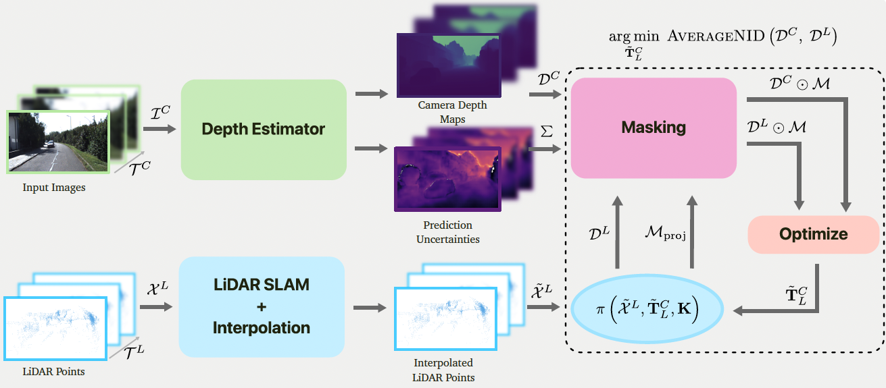

# DDCalib

<p align="center">
    
</p>

Inspired by [Petek *et al.*](https://arxiv.org/abs/2404.17298), [Koide *et al.*](https://arxiv.org/abs/2302.05094), [Borer *et al.*](https://openaccess.thecvf.com/content/WACV2024/papers/Borer_From_Chaos_to_Calibration_A_Geometric_Mutual_Information_Approach_To_WACV_2024_paper.pdf)'s approaches, this work provides a targetless calibration prototype based on depth-to-depth features through monocular depth estimation. The method also supports single-shot calibration, for which the pipeline is identical, except that the LiDAR interpolation step is dropped. 

> Please note that this is only a prototype implementation of the proposed method, and it is certainly not free of bugs as it was only tested for a limited subset of the KITTI raw synced + rectified dataset.

## Usage

### Run Pipeline

Run the following commands for the single-shot example using the frame in the data folder. Changing the variables to process your sequence should be intuitive. Please note that the `config/config.yaml` configuration is assumed to correspond to the directory structure given in this readme.

Single-shot: Your clone of the repo will already contain the data to run the single-shot example, thereby making it the best place to start testing the pipeline.

```sh
START_FRAME_ID=1130               # ID of first frame in seq: for example, 1130 (see '{images, lidar}/data')
NUM_FRAMES=1                      # number of consecutive frames to process (should be >1 for interpolation)
LIDAR_PATH="data/lidar/data/"

# do monocular depth prediction for those frames
# NOTE: only has to be done once
python unidepth_predict.py --start_frame_id $START_FRAME_ID \
                           --num_frames $NUM_FRAMES

# single-shot example (i.e IF num_frames == 1)
python main.py --start_frame_id $START_FRAME_ID \
                   --num_frames $NUM_FRAMES \
                   --is_example \
                   --add_noise
```

Should output a calibration error close to the below:

```txt
Rotation errors:
E_R = 0.536
Roll = 0.524, Pitch = 0.067, Yaw = 0.094
-----------------------------------------------------
Translation errors:
E_t 7.694 (in cm)
tx = 6.774
ty = 1.648
tz = 3.255
```

---


<details>

<summary>Multi-frame details</summary>

The multi-frame example requires downloading the KITIT dataset as described in the [Dataset](#dataset) section.

```sh
# TODO: add the desired images and LiDAR frames to the data directory 
#              (e.g 4 frames following 1130)
START_FRAME_ID=1130
NUM_FRAMES=5
LIDAR_PATH="data/lidar/data/"

# do monocular depth prediction for those frames
python unidepth_predict.py --start_frame_id $START_FRAME_ID \
                           --num_frames $NUM_FRAMES

# for LiDAR interpolation, first estimate poses
kiss_slam_pipeline $LIDAR_PATH \
                    --config config/kiss_slam.yaml \
                    -rs \
                    -n $NUM_FRAMES

# you can reduce NUM_FRAMES to for example 3 frames, which still allows for interpolation and reduces computation time
python main.py --start_frame_id $START_FRAME_ID \
                   --num_frames $NUM_FRAMES \
                   --interpolate
                   #--rotation_only
```


</details>


### Guidelines

The following insights were gained throughout the development and experiments, and may serve as useful guidelines when exploring the proposed method. The code contains 'TODOs' with instructions for custom experiments.

**Calibration tips**.

- Using prediction confidence masking (i.e., applying a confidence threshold >0%) did not always improve calibration results and, in some cases, actually worsened them, but it's worth exploring more (e.g on lower resolution images etc.).

- Prefered observation properties: typical urban scene with buildings, little vegetation, and depth variation in the 5m to 60m range.

- LiDAR interpolation does improve calibration, but is only implemented for KITTI dataset format, which has accurate timestamps.

- Using more than one frame for optimization did not improve results. Therefore, it is recommended to do the LiDAR SLAM on 5 - 10 frames, and then pass the first frame ID (i.e the same `START_FRAME_ID`) with `NUM_FRAMES` (N) reduced to N=2 or N=3, such that only N-1 (\*) frames are used for the optimization, thereby making it less computationally expensive. *(\*) (bec. 1 frame is dropped during interpolation)*

**Not tested**.

- Datasets other than KITTI synced + rectified. Please check whether your depth estimation model was trained on the dataset you use in your experiments because otherwise your experiments will be highly unrepresentative. KITTI was not used for UniDepthV2, but for example Argoverse was used.

- Effect of dynamic objects

- High-speed vehicle movement

- LiDAR data without deskewing / motion compensation


**Not working**.

- Initial rotation and translation errors greater than 5° and 50 cm, respectively, could not be resolved by the proposed method.


## Dataset

Example dataset preparation for sequence 00.

1. Download sequence 00 from KITTI raw (incl. calibration) - [download raw](https://s3.eu-central-1.amazonaws.com/avg-kitti/raw_data/2011_10_03_drive_0027/2011_10_03_drive_0027_sync.zip) + [download calibration](https://s3.eu-central-1.amazonaws.com/avg-kitti/raw_data/2011_10_03_calib.zip)

2. Download odometry velodyn (KITTI Odometry dataset, 70+GB), which is motion compensated. - [download](https://s3.eu-central-1.amazonaws.com/avg-kitti/raw_data/2011_10_03_calib.zip)

3. Extract 00 from odometry_velodyn and put corresponding frames in 'data/lidar/data' (not the raw lidar frames, only their timestamps.txt file).

4. Check that directory structure corresponds to what is illustrated below.

```txt
└── data
    ├── calib_velo_to_cam.txt
    ├── calib_cam_to_cam.txt
    └── synced_data
            ├── images
            │    ├── timestamps.txt
            │    └── data
            │        ├── 0000000000.png        // the example only contains 1130.png (i.e single-shot)
            │        ├── 0000000001.png
            │        ├── ...
            │
            └── lidar
                 ├── timestamps.txt           // lidar timestamps from raw dataset
                 └── data                    // should be motion compensated!
                     ├── 0000000000.bin     // the example only contains 1130.bin (i.e single-shot)
                     ├── 0000000001.bin
                     ├── ...
```


## Installation

First, install the general Python packages.

```sh
# general requirements
pip install -r requirements.txt

# you might need to do
python -m pip install --upgrade --force-reinstall numpy-quaternion
```

### UniDepth V2

[GitHub](https://github.com/lpiccinelli-eth/UniDepth/tree/main)

```sh
# for machines w/ NVIDIA GPU see official installation guide in their README.md
# for running it on a CPU (e.g it worked on my MacBook)
git clone https://github.com/lpiccinelli-eth/UniDepth.git
cd UniDepth
# ASSUMPTION: you're in your venv
# DO: remove xformers and triton from the UniDepth's requirements.txt if you don't have CUDA enabled GPU
pip install -e . 
```


## References

- [UniDepthV2](https://arxiv.org/abs/2502.20110)
- [MDPCalib](https://github.com/robot-learning-freiburg/MDPCalib?tab=readme-ov-file)
- [CMRNext](https://github.com/robot-learning-freiburg/CMRNext)
- [Koide et. al](https://github.com/koide3/direct_visual_lidar_calibration)
- [Borer et. al](https://openaccess.thecvf.com/content/WACV2024/papers/Borer_From_Chaos_to_Calibration_A_Geometric_Mutual_Information_Approach_To_WACV_2024_paper.pdf)
